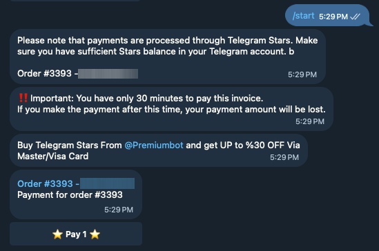
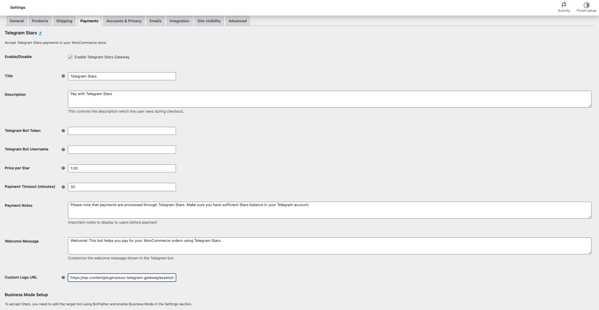

# WooCommerce Telegram Stars Gateway

  

A powerful WooCommerce payment gateway that seamlessly integrates Telegram Stars as a payment method for your online store. This plugin enables customers to pay for their purchases using Telegram's built-in Stars currency, expanding your payment options and tapping into Telegram's vast user base.

## Features

- 🔄 **Seamless Integration**: Connects your WooCommerce store with Telegram's payment infrastructure
- ⚙️ **Easy Configuration**: Simple setup with customizable settings for your specific needs
- 🔐 **Secure Payment Flow**: Directs customers to your Telegram bot to complete payments securely
- 📦 **Automatic Order Management**: Updates order statuses automatically once payment is received
- 💬 **Customizable Messaging**: Personalize all customer-facing messages and notifications
- 💱 **Currency Conversion**: Automatically converts your store currency to Stars with configurable rates
- ⏱️ **Payment Notifications**: Clear payment instructions and deadline notifications
- 🤖 **Telegram Bot Integration**: Works with your own Telegram bot (created via @BotFather)
- 💼 **Business Mode Support**: Compatible with Telegram's Business Mode for accepting payments
- 📱 **Mobile-Friendly**: Great user experience on both desktop and mobile devices

## Screenshots

  
   
  <em>Customer Checkout View</em>

  
   
  <em>Payment Gateway Settings</em>

## Installation

Download [latest Release](https://github.com/Aliasgharhi/woo-telegram-gateway/releases/latest)

Go To WordPress Dashboard → Plugins → Add New → Upload Plugin and choose the plugin and upload it

## Configuration

1. Create a new Telegram bot using [@BotFather](https://t.me/botfather)
2. Enable payments for your bot using @BotFather
   - Send `/mybots` to @BotFather
   - Select your bot
   - Click "Setting"
   - Select a "Bussines Mode"
   - Follow the instructions to set up payments
3. Go to WooCommerce → Settings → Payments
4. Find "Telegram Stars" in the payment methods list
5. Click "Manage" to configure the gateway
6. Fill in the following settings:
   - Enable/Disable: Enable the gateway
   - Title: The payment method title shown at checkout
   - Description: The payment method description shown at checkout
   - Telegram Bot Token: Your bot token from @BotFather
   - Bot Username: Your bot username (without @ symbol)
   - Price per Star: The price of one Telegram Star in your store currency
   - Payment Timeout: Time in minutes before the payment expires
   - Payment Notes: Important notes to display to users before payment
   - Welcome Message: Customize the bot's welcome message

## Requirements

- WordPress 5.8 or higher
- WooCommerce 5.0 or higher
- PHP 7.4 or higher
- SSL certificate (required for Telegram payments)
- Telegram Bot Token (obtained from @BotFather)

## Donation

If you appreciate this plugin and would like to support ongoing development, you can send Telegram Stars to **@Aliasgharhi** on Telegram. Your donations help maintain the plugin and add new features.

## License

This project is licensed under the GPL v2 or later - see the [LICENSE](LICENSE) file for details.

## Credits

- Developed by [Aliasgharhi](https://github.com/Aliasgharhi/)
- Uses the [Telegram Bot API](https://core.telegram.org/bots/api)
- Built for [WooCommerce](https://woocommerce.com) 
